# Architecture & flow diagrams
{: .no_toc }

How Banwatch is put together and how a ban travels through it. Every diagram on this page
is generated from the code it describes — file and function names are given underneath each
one so a diagram can be checked against the source rather than trusted.

  
Table of contents

  {: .text-delta }
- TOC
{:toc}

---

## 1. System overview

Banwatch is a single Python process: a sharded discord.py bot, a FastAPI app, and a
background task queue sharing one MySQL/MariaDB database.

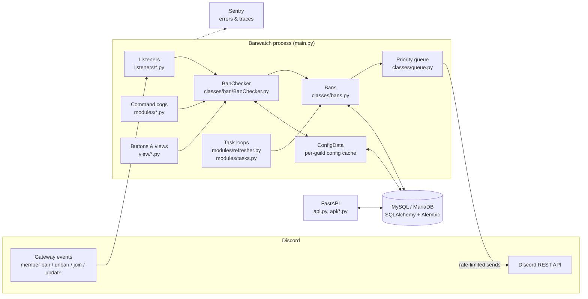

Everything that talks to Discord in bulk goes through the priority queue
(`classes/queue.py`, priorities: 2 = high, 1 = normal, 0 = low) so a mass operation cannot
exhaust the API rate limit. `ConfigData` is a singleton cache of the `config` table, read on
nearly every path.

---

## 2. The ban flow (live ban)

This is the main path: a moderator bans someone in a server that has Banwatch, and
`listeners/on_member_ban.py` decides what happens next.

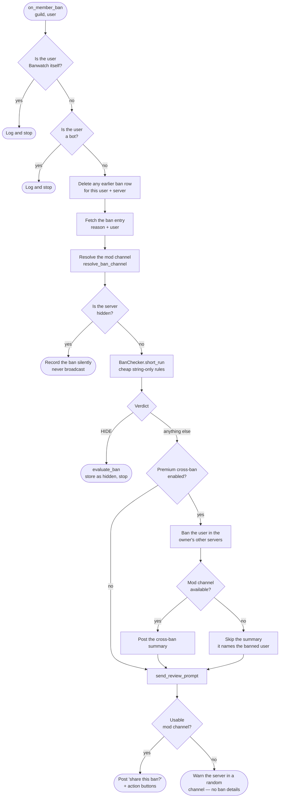

`listeners/on_member_ban.py`, `classes/ban/BanChecker.py:short_run`.

The pre-check is deliberately cheap: only the string-only auto-hide rules run on every ban.
The full rule set runs later, when a moderator actually presses a button.

---

## 3. Choosing where to post, and what happens when there is nowhere

Every ban message a server sees goes to its configured mod channel. When that channel is
unset, deleted, or unwritable, Banwatch warns the server in a random channel it *can* post
in, rather than failing silently.

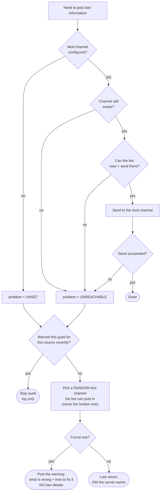

`classes/ban/ban_channel.py`.

Two rules hold this together:

- **Ban details go to the mod channel or nowhere.** The fallback channel is picked because
  it is *reachable*, not because it is private — it may well be a public channel. The
  warning therefore never names the banned user or quotes the ban reason.
- **Warnings are rate limited per guild and per source.** A server that bans ten people in
  a row is told once (`DEFAULT_COOLDOWN`, 1 hour). Background sources — the two-hourly ban
  sweep and bans arriving from other servers — use `SLOW_COOLDOWN`, once a day.

---

## 4. The BanChecker rule pipeline

`BanChecker` is the single source of truth for ban vetting; every path routes through it.
Rules run in a fixed order and the **first** rule to reach a verdict wins — `perform_action`
skips every later rule once the status is no longer `PROMPT`.

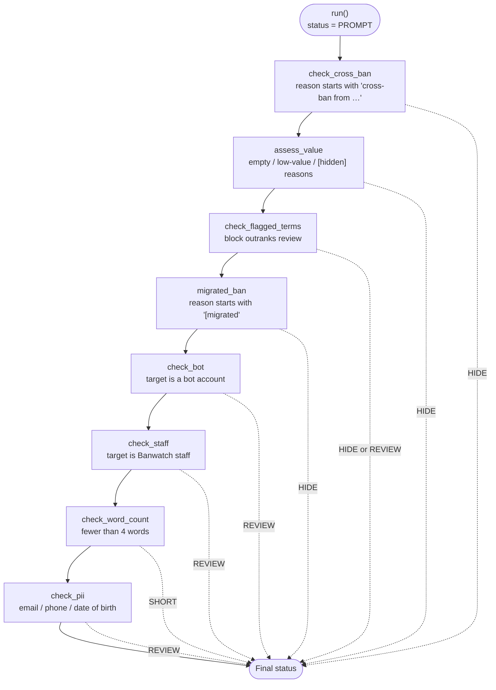

`classes/ban/BanChecker.py:run`. The live path calls `short_run()` instead, which runs only
the first two rules plus `migrated_ban`.

Order is load-bearing: a one-word slur must be caught by `check_flagged_terms` (HIDE) before
`check_word_count` can downgrade it to SHORT, and a cross-ban must be hidden before anything
else looks at its wording. Both are covered by `tests/test_modules/test_ban_checker.py`.

---

## 5. What each verdict does

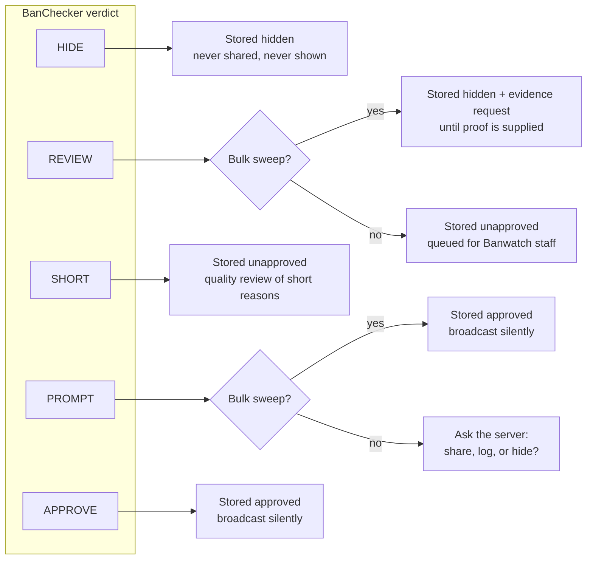

`classes/ban/BanChecker.py:evaluate_ban`. "Bulk sweep" is the `server_only=True` flag, set
when the periodic scan imports a server's existing bans — in that mode Banwatch never asks
the server a question it did not expect.

---

## 6. The moderator's choice

When a ban is not auto-hidden, the server's staff get four buttons. Pressing one runs the
**full** rule set (not the cheap pre-check) before anything is stored or shared.

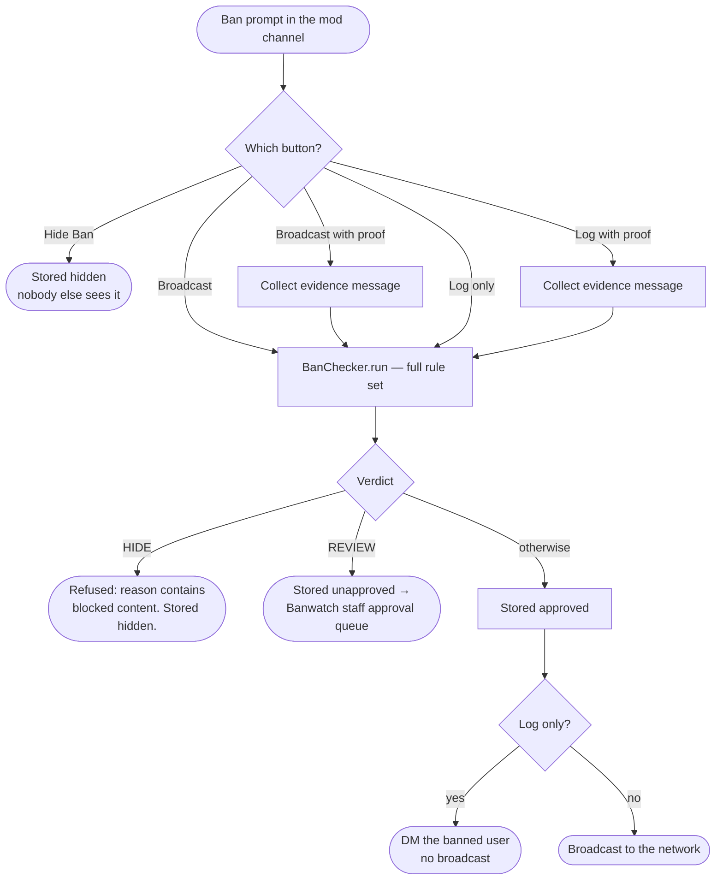

`view/buttons/banoptionbuttons.py`. "Log only" still means other servers see the ban when
the user joins them or is looked up — it only suppresses the push notification.

---

## 7. Broadcasting a ban to the network

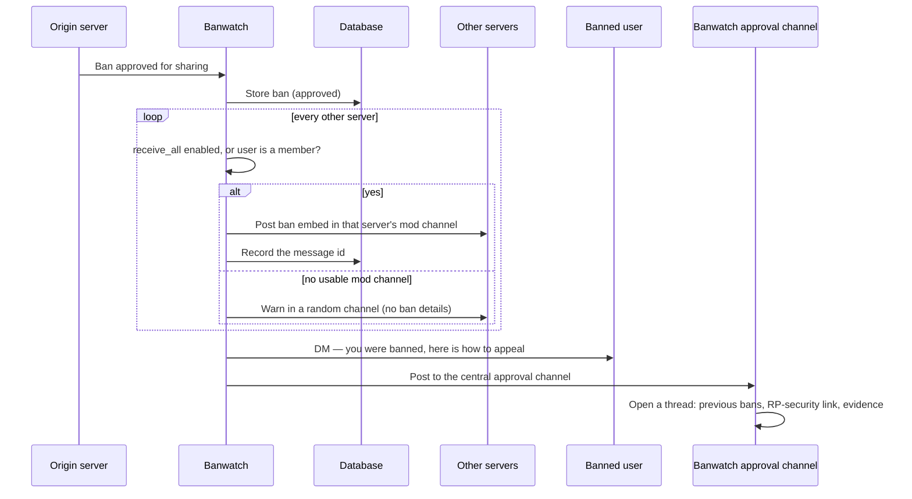

`classes/bans.py:check_guilds`, `inform_server`, `send_to_ban_channel`, `open_thread`.

Recording the message id per server (`ban_messages`) is what makes revocation possible: when
a ban is lifted, Banwatch knows exactly which message to delete in which server.

---

## 8. The periodic sweep

Every two hours Banwatch walks every server it is in, imports bans it has not seen, and
drops bans that no longer exist.

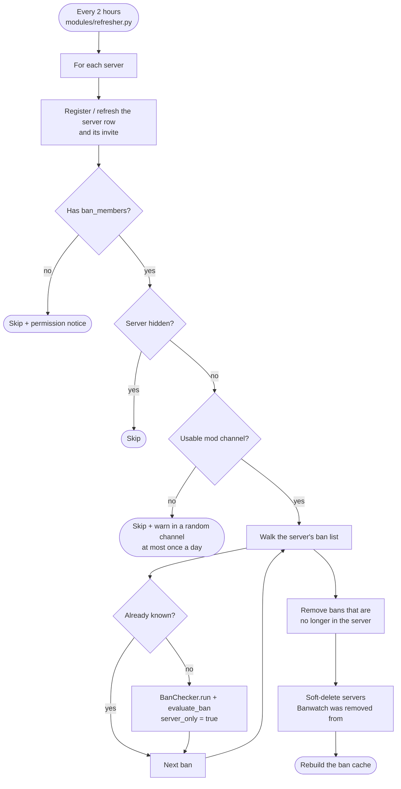

`classes/bans.py:update` and `check_guild_bans`. This is also the repair path: once a server
fixes its mod channel, the next sweep picks up every ban it missed in the meantime.

---

## 9. Lifting a ban

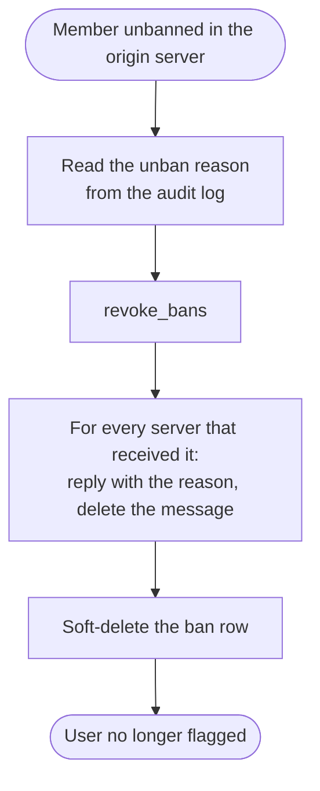

`listeners/on_member_unban.py`, `classes/bans.py:revoke_bans`. A soft delete
(`deleted_at`) hides the record everywhere immediately; the row is removed permanently when
the same user is banned again in that server, and by the staff purge tools.

---

## 10. Someone with a record joins a server

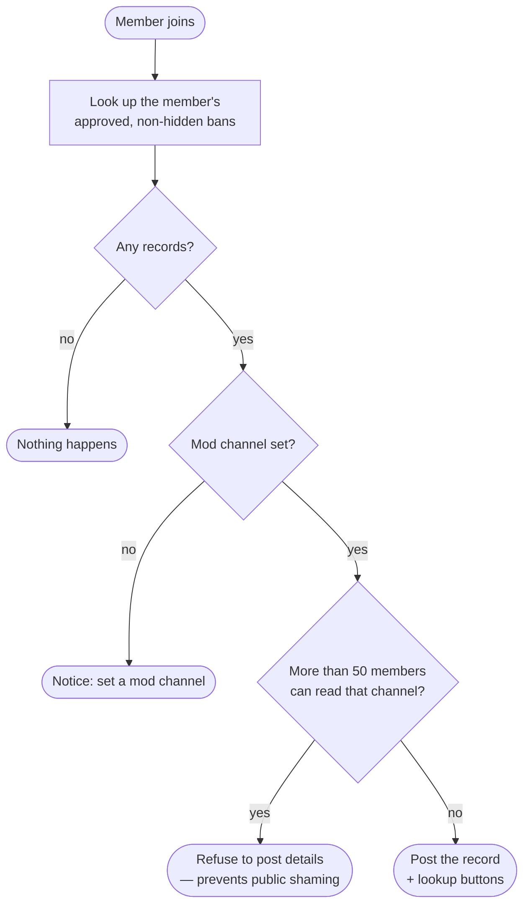

`listeners/on_join.py`. Banwatch never bans anyone automatically — it reports, the server
decides.

---

## 11. Appeals

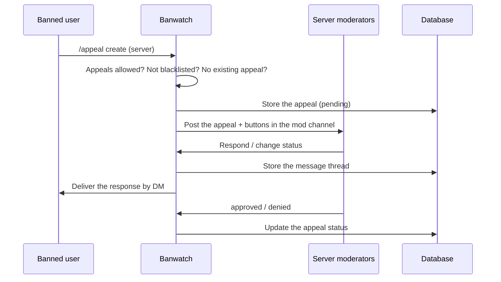

`modules/Appeals.py`, `view/buttons/appealbuttons.py`. Appeals are per ban, and a user may
only have one open appeal per server.

---

## 12. Evidence

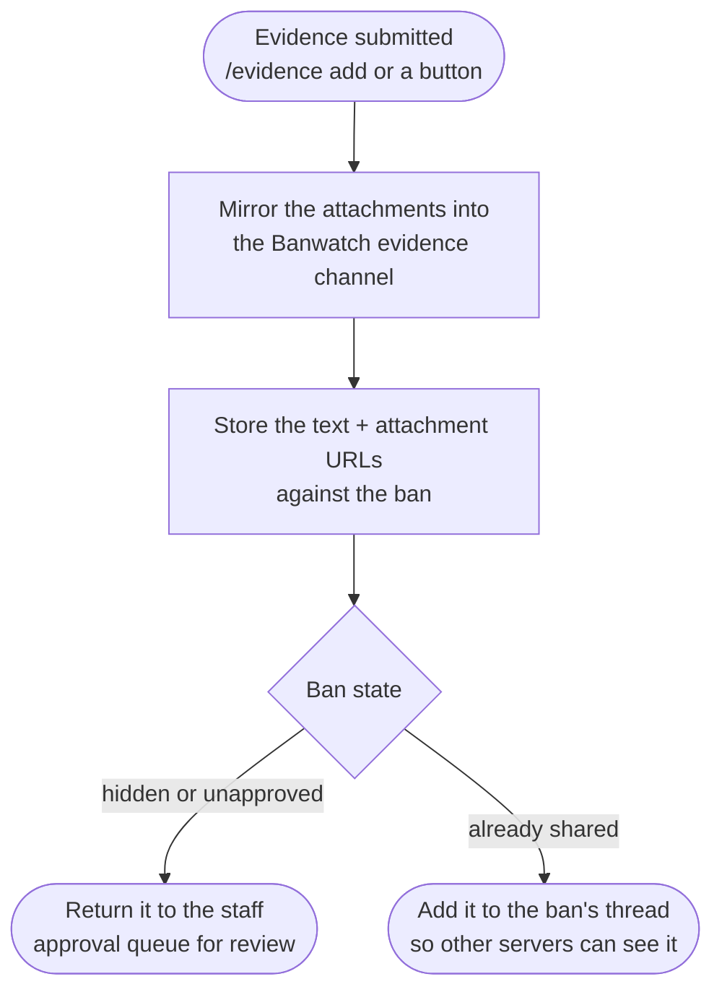

`classes/evidence.py`. Attachments are re-uploaded to a Banwatch-controlled channel so the
evidence survives the original message being deleted; the database stores URLs, not files.

---

## 13. Data model

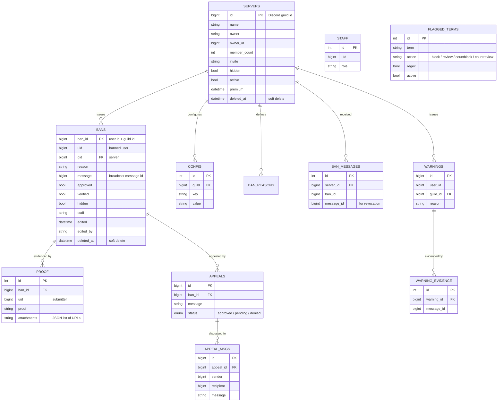

`database/current.py`. Note `ban_id = user_id + guild_id`: the ban key is derived, which is
why a user can hold only one ban record per server, and why re-banning replaces the old row.

`STAFF` and `FLAGGED_TERMS` are global tables with no server relationship — they belong to
Banwatch itself rather than to any one server.

---

## Keeping these diagrams honest

If you change the ban flow, update the diagram in the same commit. The rule ordering in
§4 and the verdict routing in §5 are both pinned by
`tests/test_modules/test_ban_checker.py`, and the fallback behaviour in §3 by
`tests/test_modules/test_ban_channel.py` — if a diagram and a test disagree, the test is
right.
