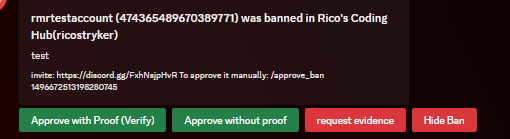

<h1 style="text-align: center">Staff Guidelines</h1>
<h6 style="text-align: center">This part of the documents is only relevant to banwatch staff, but is available to the public for transparency.</h6>

## What is expected of a banwatch staff member?

A banwatch staff member is often an influential member in the community or the a server owner who has volunteered their
time to help ensure that the bans we verify are legitimate and without bias.

We expect:

* A banwatch staff member may not handle bans from their own servers, or when there is a conflict of interest.
* A banwatch staff member should handle evidence with care to ensure no other users are targeted.
* A banwatch staff member may investigate claims; even if these are not awaiting verification.
* A banwatch staff member must ensure that ToS is followed in the servers they visit; as well as ensuring that banwatch
  follows discord ToS

## Approving bans

As you can see there are four buttons, each button has its own unique function which affects how bans are stored and/or broadcasted. By pressing one of the buttons you disable the rest.
* Approve with Proof (Verify): By verifying a ban, it means that the proof was sufficient and that banwatch endorses its validity.
* Approve without proof: This is for bans which do not need proof, but are accidentally flagged by the filter.
* Request Evidence: This button sends a message to the server where the ban originates from and requests them to provide evidence. This button does not disable the other buttons.
* Hide Ban: If no proof is provided or the proof is insufficient, we will hide the ban; this means the ban wont be broadcasted and can not be viewed by regular users.

## Commands
<h6>For all commands in this section, you must be registered as a staff member.</h6>

### `/staff servers`
This command allows you to view **all** the servers the bot is in, this command can be used for a quick glance at the servers and to find invites to the servers if investigation is needed.

### `/staff serverinfo server:(guild_id)`
This command allows staff to view information about a server, this is often used to determine if a server is legit as we have had a few users trying to make fake servers and spread false information. 

The information this command returns is: Owner + owner id, bot count, user count, role count, channel count, creation date, number of bans, invite, and MFA level. All of these can be used to decide the legitimacy of a server and should _never_ be shared outside of the staff channels.

### `/staff userinfo user:(user_id or user ping)`
This command allows staff to view information about an user: User name, id, common servers, the amount of bans, what flags they have, and when their account was created.

This information may not be shared outside of banwatch's staff channels and should strictly be used for investigations.

### `/staff banverification ban_id:(ban id) status:(true/false) provide_proof:(true/false)`
With this command you can toggle a commands verification status, is a ban verified but it shouldn't be? then you run this command with the ban id, status on false and provide proof also on false.

When you run it with provide_proof on true, you will be prompted to provide proof. After proof has been provided it will set the ban to verified. All verified bans should have a minimum of one evidence.

### `/staff banvisibility ban_id:(ban_id) status:(True/False)`
With this command you can toggle the visibility of a ban; meaning if it is hidden or not. We can hide bans that are false and/or irrelevant to regular users. This may be done upon request of the server or upon request of the user (if there is enough evidence that the ban is false).